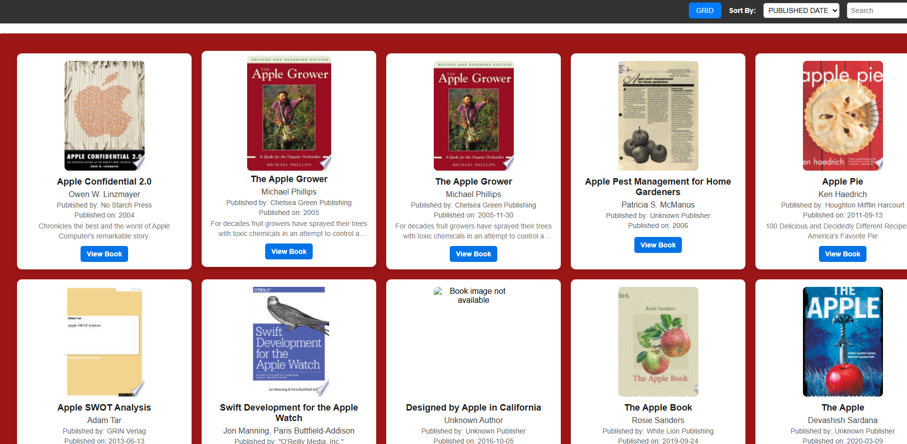
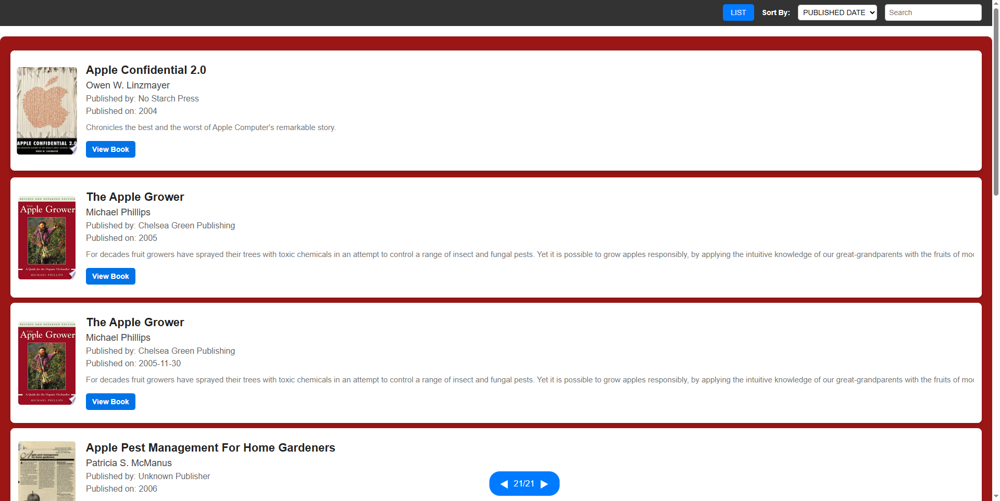
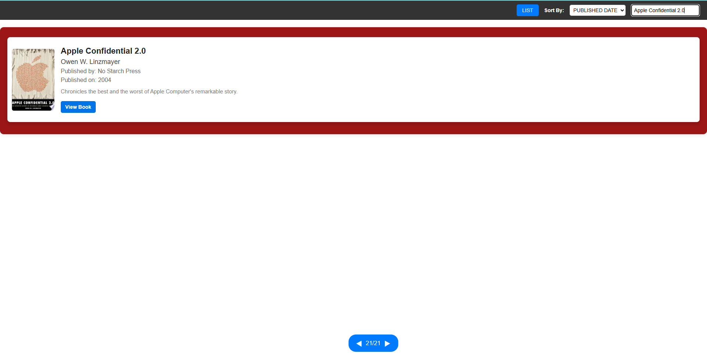

# Book Library

A dynamic Book Library website that fetches book data from the FreeAPI.app and displays it in an interactive and user-friendly manner. This project helps in understanding API requests, handling JSON data, and rendering content dynamically using JavaScript.

 ### 🚀 Features

- ✅ Fetch books from the API and display them as a list/grid view
- ✅ Toggle between list and grid view
- ✅ Display book details including title, author, publisher, published date, and thumbnail
- ✅ Search books by title or author
- ✅ Sort books alphabetically by title or by published date
- ✅ Implement pagination to fetch more books on scrolling to the end
- ✅ Clicking on a book opens detailed information in a new tab using the infoLink

### 🛠️ Tech Stack

- HTML
- CSS
- JavaScript

📸 Screenshots

### 🔗 API Endpoint

- GET https://api.freeapi.app/api/v1/public/books

